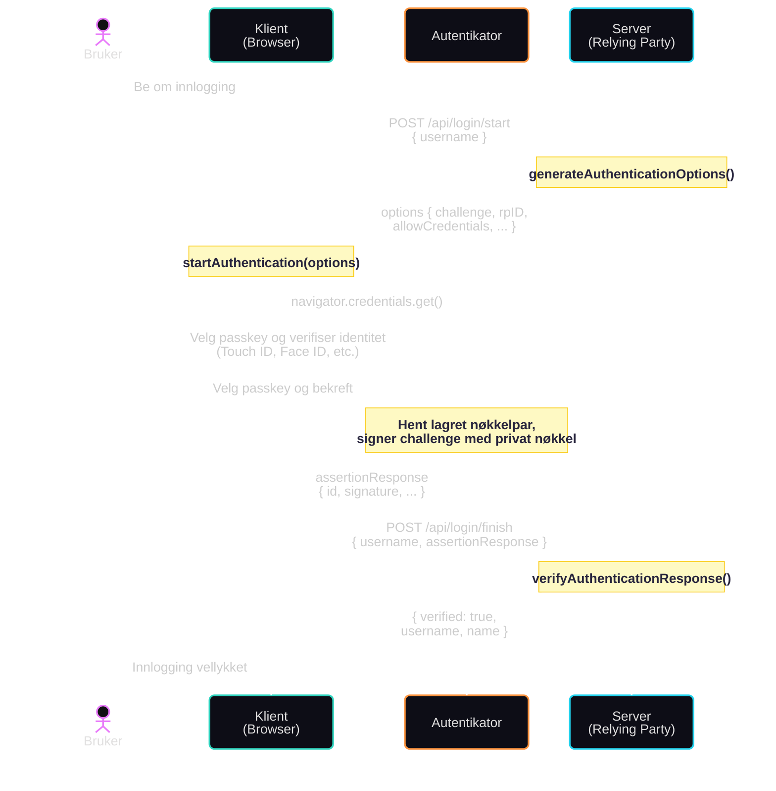

# Innloggingsflyt - Teknisk

```mermaid
---
config:
  theme: redux-dark-color
  look: neo
---
sequenceDiagram
    actor B as Bruker
    participant K as Klient<br>(Browser)
    participant A as Autentikator
    participant S as Server<br>(Relying Party)

    B->>K: Be om innlogging
    K->>S: POST /api/login/start<br>{ username }
    Note over S: generateAuthenticationOptions()
    S-->>K: options { challenge, rpID,<br>allowCredentials, ... }
    Note over K: startAuthentication(options)
    K->>A: navigator.credentials.get()
    A->>B: Velg passkey og verifiser identitet<br>(Touch ID, Face ID, etc.)
    B-->>A: Velg passkey og bekreft
    Note over A: Hent lagret nøkkelpar,<br>signer challenge med privat nøkkel
    A-->>K: assertionResponse<br>{ id, signature, ... }
    K->>S: POST /api/login/finish<br>{ username, assertionResponse }
    Note over S: verifyAuthenticationResponse()
    S-->>K: { verified: true,<br>username, name }
    K->>B: Innlogging vellykket
```
