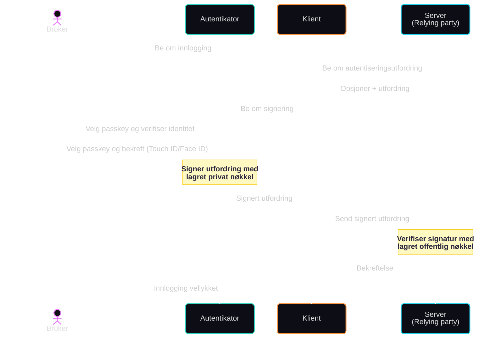

# Innloggingsflyt - Passkey

```mermaid
---
config:
  theme: redux-dark-color
  look: neo
---
sequenceDiagram
    actor B as Bruker
    participant A as Autentikator
    participant K as Klient
    participant S as Server<br>(Relying party)

    B->>K: Be om innlogging
    K->>S: Be om autentiseringsutfordring
    S-->>K: Opsjoner + utfordring
    K->>A: Be om signering
    A->>B: Velg passkey og verifiser identitet
    B-->>A: Velg passkey og bekreft (Touch ID/Face ID)
    Note over A: Signer utfordring med<br>lagret privat nøkkel
    A-->>K: Signert utfordring
    K->>S: Send signert utfordring
    Note over S: Verifiser signatur med<br>lagret offentlig nøkkel
    S-->>K: Bekreftelse
    K->>B: Innlogging vellykket
```
