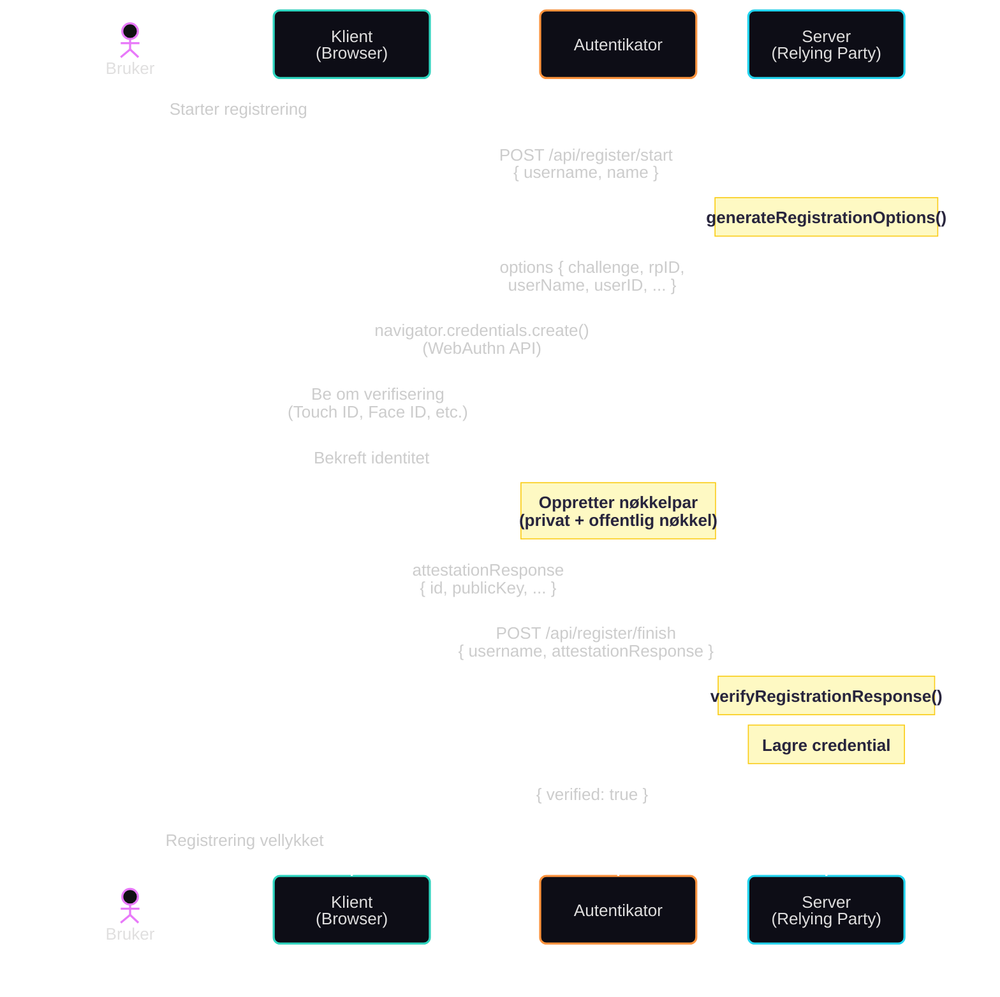

# Registreringsflyt - Teknisk

```mermaid
---
config:
  theme: redux-dark-color
  look: neo
---
sequenceDiagram
    actor B as Bruker
    participant K as Klient<br>(Browser)
    participant A as Autentikator
    participant S as Server<br>(Relying Party)

    B->>K: Starter registrering
    K->>S: POST /api/register/start<br>{ username, name }
    Note over S: generateRegistrationOptions()
    S-->>K: options { challenge, rpID,<br>userName, userID, ... }
    K->>A: navigator.credentials.create()<br>(WebAuthn API)
    A->>B: Be om verifisering<br>(Touch ID, Face ID, etc.)
    B-->>A: Bekreft identitet
    Note over A: Oppretter nøkkelpar<br>(privat + offentlig nøkkel)
    A-->>K: attestationResponse<br>{ id, publicKey, ... }
    K->>S: POST /api/register/finish<br>{ username, attestationResponse }
    Note over S: verifyRegistrationResponse()
    Note over S: Lagre credential
    S-->>K: { verified: true }
    K-->>B: Registrering vellykket
```
